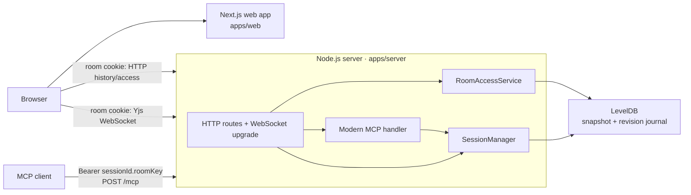
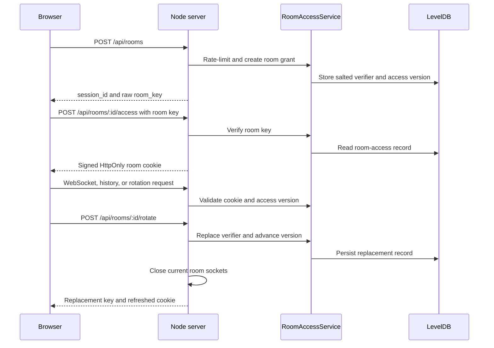
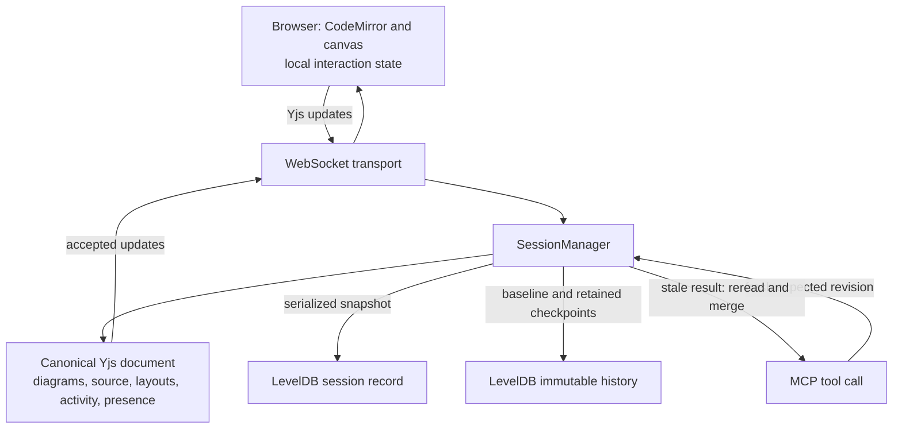
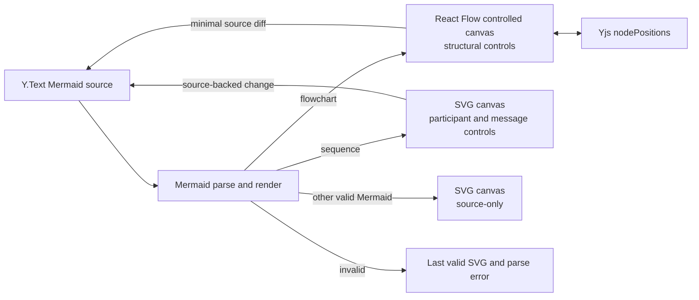

# ArielCharts architecture

This document describes the implemented repository architecture at the time of
writing. It is a map of durable boundaries, not a substitute for the detailed
invariants in [docs/context-map.md](docs/context-map.md). For local setup and
commands, use [README.md](README.md); for work rules, use [AGENTS.md](AGENTS.md).

## System at a glance

ArielCharts is a pnpm monorepo for private, collaborative Mermaid workspaces.
The browser and MCP clients mutate one server-owned Yjs document per room.
Mermaid source is canonical; rendered SVG, structural editing affordances, and
most workspace interaction state are derived from it.

## Stack and workspace

| Area | Technology | Responsibility |
| --- | --- | --- |
| Package management | pnpm 10.15; Node.js 24+ | Root workspace scripts and reproducible dependency installation. |
| Browser | Next.js 16, React 19, TypeScript | Landing page, protected session route, local workspace state, and rendering. |
| Editor and collaboration | CodeMirror 6, Yjs, y-codemirror.next, y-websocket | Collaborative source editing, cursor/presence transport, and document convergence. |
| Diagram workspace | Mermaid, mermaid-ast, React Flow | Mermaid SVG rendering; scoped flowchart and sequence editing controls. |
| Server | Node.js HTTP, `ws`, Yjs protocols, Zod | HTTP/WebSocket ingress, access checks, session lifecycle, and MCP schemas. |
| Storage | LevelDB | Encoded Yjs session snapshots, access records, and immutable per-diagram history. |
| Agent interface | `@modelcontextprotocol/node` and `@modelcontextprotocol/server` | Modern, room-scoped MCP tools over `POST /mcp`. |

| Workspace | Owns |
| --- | --- |
| `apps/web` | Next.js routes and browser workspace. `session-workspace.tsx` coordinates Yjs, CodeMirror, rendering, and local UI. |
| `apps/server` | Raw Node HTTP server, room access, WebSocket replication, MCP endpoint, persistence, and session cleanup. |
| `packages/shared` | Public TypeScript contracts, source/layout policy, and immutable starter templates. It contains no browser or server behavior. |

## Protected-room access

Every room is protected. Creating one generates a raw room key and stores only
a salted verifier and access version. The browser uses the fragment form once,
then relies on an HttpOnly cookie. An MCP client supplies the separate bearer
form on every request. Key rotation advances the access version and terminates
live room sockets.

The server accepts explicit browser origins only in production, requires
`ROOM_COOKIE_SECRET`, and uses `CLIENT_ADDRESS_PROFILE=fly` only when the
single Fly client-IP header is the intended trusted source. It does not use
`X-Forwarded-For` as a general trust signal.

## Shared state, writes, and persistence

The root Yjs keys are `diagrams`, `diagramOrder`, `activity`, and `presence`.
Each diagram contains a name, Mermaid `Y.Text`, and `nodePositions` `Y.Map`.
The server repairs the durable catalog and serializes persistence; browser
selection, camera, toolbar, flyout, drafts, and active drag presentation stay
local.

MCP is an application writer, not an MCP transport-session owner. `getSession`
returns a session revision for creation. `readDiagram` returns a diagram
revision for replacement, rename, deletion, and restore. A stale revision is a
conflict signal: callers reread and deliberately merge before a retry. The
registered tools are `getSession`, `createDiagram`, `readDiagram`,
`listDiagramHistory`, `readDiagramRevision`, `writeDiagram`, `renameDiagram`,
`deleteDiagram`, and `restoreDiagramRevision`; a `diagrammingWorkflow` prompt
documents that sequence.

## Rendering and editing boundary

Mermaid source is the only durable diagram definition. React Flow is a
controlled presentation for flowcharts; its node positions are durable only
where the accepted source/layout policy permits them. Sequence controls append
source-backed participants and messages. Other valid Mermaid remains editable
in the source editor and navigable as SVG without structural mutation controls.

The web app keeps preview state per stable diagram ID so a last-valid SVG and
parse error do not leak across tabs. It also keeps local-only theme, camera,
selection, undo origins, and overlay state out of the durable document.

## Interfaces and deployment

| Interface | Authentication and role |
| --- | --- |
| `POST /api/rooms` | Creates a protected room, subject to origin checks and creation rate limiting. |
| `POST`/`GET /api/rooms/:sessionId/access` | Exchanges a room key for, or validates, a browser room cookie. |
| `POST /api/rooms/:sessionId/rotate` | Cookie-authorized key rotation and immediate socket revocation. |
| `GET`/`POST /api/sessions/:sessionId/diagrams/...` | Cookie-authorized current diagram and revision-history access. |
| `POST /mcp` | Modern MCP, authorized by the room-scoped bearer; no session-directory discovery. |
| `/ws/:sessionId` | Cookie-authorized Yjs sync and filtered awareness replication. |
| `/health` | Readiness response. |

The repository supplies a Vercel build configuration for `apps/web`, a Fly
configuration plus Docker image for the server, and a CI server deployment on
successful pushes to `main`. Those files describe intended infrastructure; a
deployment's current external health still requires a live check.

## Verification map

The root package scripts define the standard build, lint, typecheck, and unit
test gates. Browser validation is intentionally split between owned-service
tests that build and run an isolated production-like stack and focused/manual
gates that expect explicitly supplied services. See
[docs/context-map.md#verification-and-evidence](docs/context-map.md#verification-and-evidence)
for the exact commands and CI coverage.

For ownership details, invariants, retention, and scaling limits, continue to
[docs/context-map.md](docs/context-map.md). Update that map when a durable
schema, public contract, or cross-package boundary changes.
